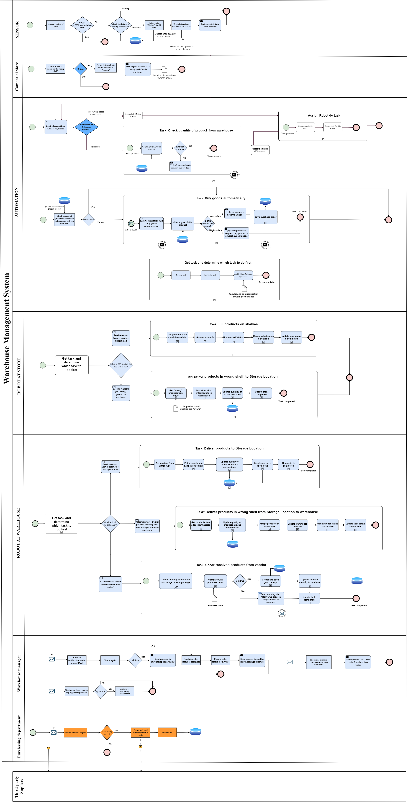
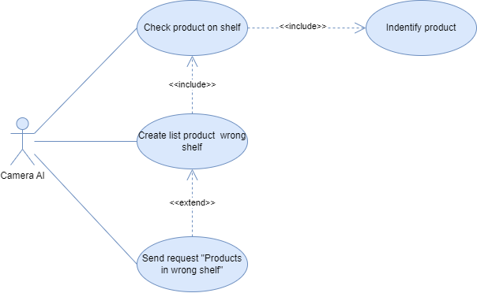
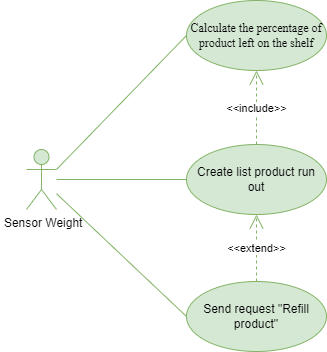
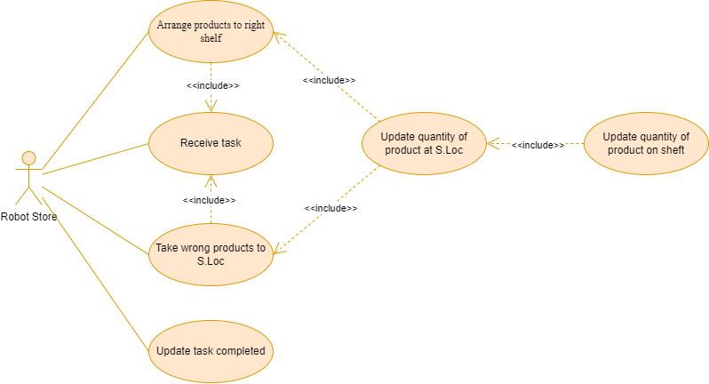
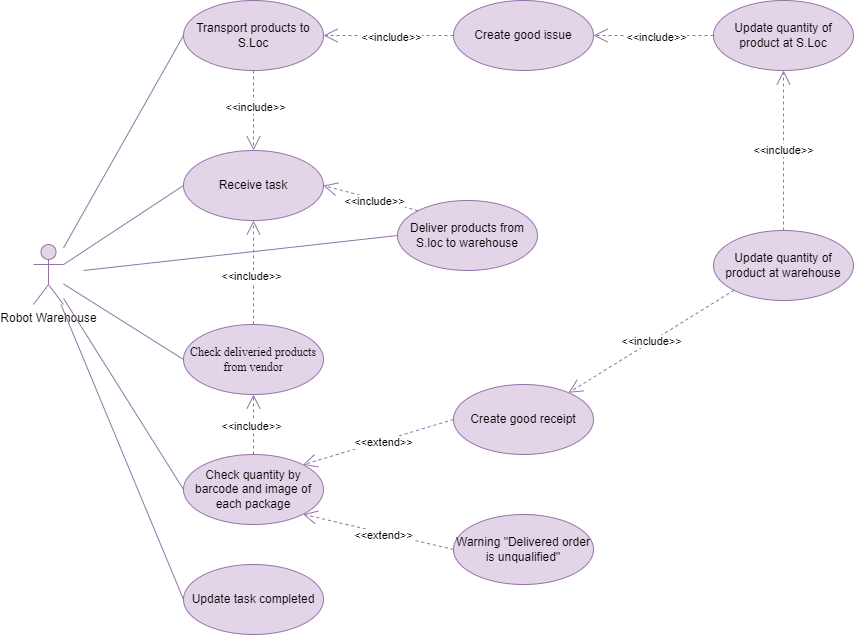
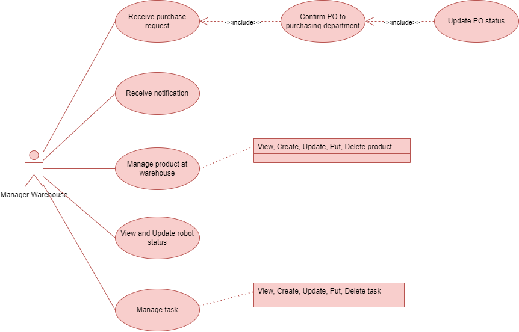
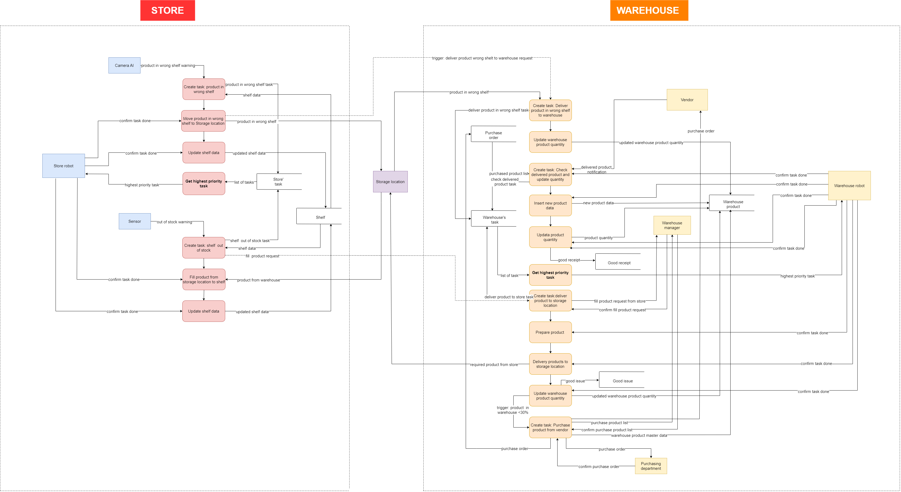
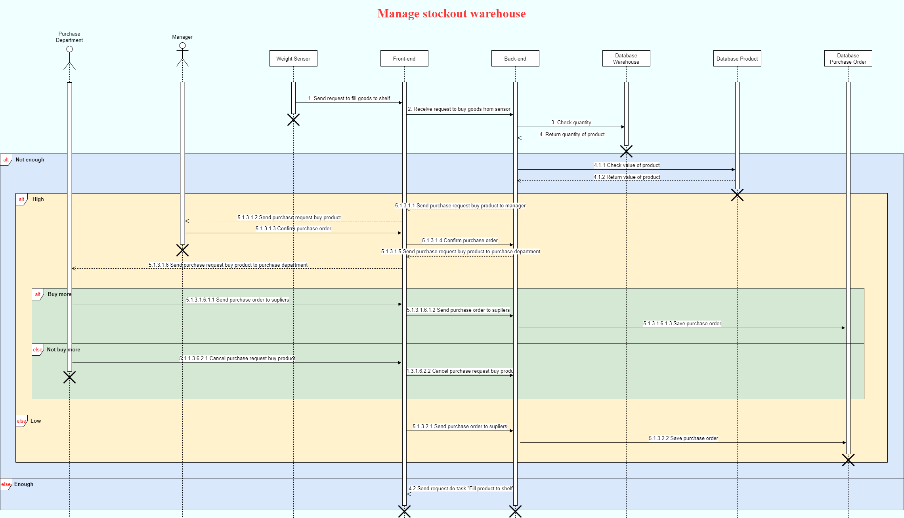
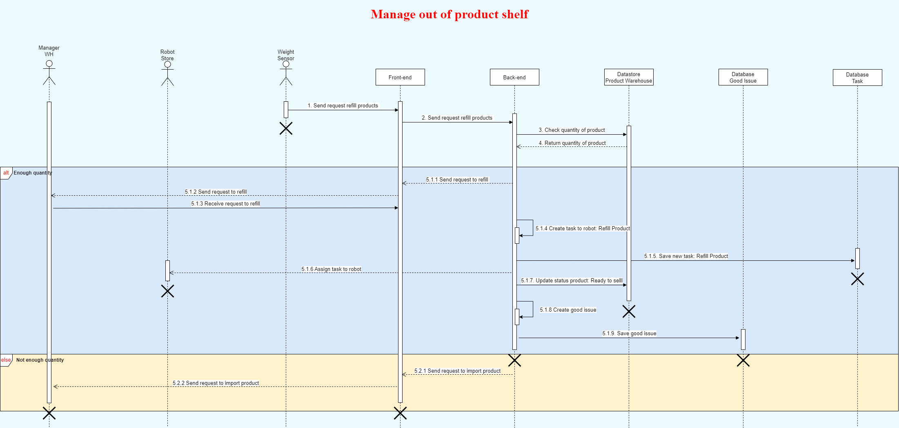
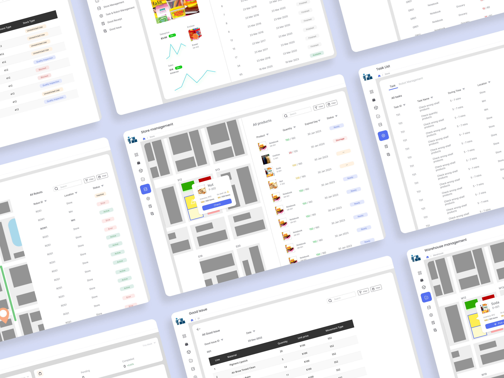

# [Warehouse And Shelf Management At Supermarket](https://github.com/thientructhai/BA_StockManagement)

## Member of group

### **`BoKho`**

| student_id | class   | full_name              | role   |
| ---------- | ------- | ---------------------- | ------ |
| K204061411 | K20406T | Nguyen Thai Ngoc Suong | Leader |
| K204061440 | K20406T | Tran Nhat Nguyen       | Member |
| K204060310 | K20406C | Thai Thien Truc        | Member |
| K204061446 | K20406C | Man Dac Sang           | Member |

# 📕 Table of contents

<!--ts-->

- 🛠️ [Requirements](#️-requirements)
- 🧙‍♂️ [Processes](#-processes)
- 🚀 [Solution](#-solution)
- 🧱 [Mockup](#-mockup)
- 📂 [Files](#-files)
<!--te-->

  

# 🛠️ Requirements

For many stores, they choose to make use of a lot of labor with manual processes for operations. However, this causes various issues and leads to bad performance. Understanding the urgency of the problem, our team applied the knowledge of the Analysis and Design Information System to propose solutions:

- Analyze and propose new process for businesses
- Use an automatic system to reduce the number of labor at stores and warehouses to increase accuracy and efficiency.
- Use robots to complete manual tasks.
- Use cameras to detect products in the wrong shelf and sensors to warn about out of product shelves.

# 🧙‍♂️ Processes

## 1. BPMN Diagram

The process includes a lot of automation that does not need the interference of humans. Moreover, most of the time, robots will be assigned to tasks instead of using labor. Manager only views and checks (if necessary) and handles some unique cases.

    BPMN diagram

## 2. Use Case Diagram

To implement the process, some actors below are required:

- <b>Camera AI</b> (at store): keep track of the products which are put on the wrong shelf.
- <b>Sensor</b> : This device will help measure the shelf ‘s weight, if the weight `< 30%` per total, it sends a warning message to the system.
- <b>Robot at store</b>: they are responsible for taking products from storage location, fill on shelves and deliver products on the wrong shelf to storage location.
- <b>Robot at warehouse</b>: they will transport products from warehouse to storage location, collect products in wrong shelves back to warehouse, check and arrange received products from vendors.
- <b>Warehouse manager</b>: They have responsible to check documents such as purchase order, good receipt or good issue and update if necessary.

    Camera AI

    Sensor

    Robot at Store

    Robot at Warehouse

    Warehouse Manager

## 3. DFD Diagram

    DFD Level 0

# 🚀 Solution

## Sequence Diagram

    Warehouse Stock management

    Shelf Product management

# 🧱 Mockup

    Shelf Product management

---

&copy; 2023 BoKho

